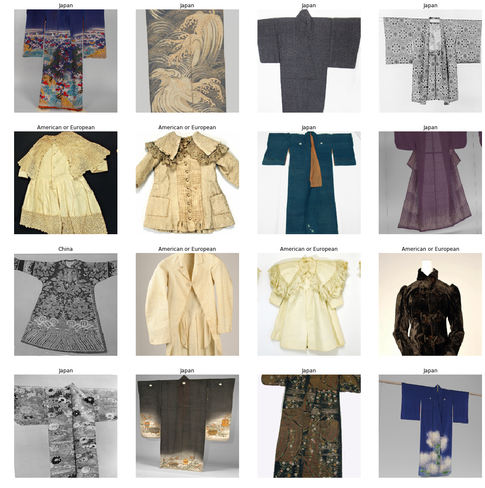
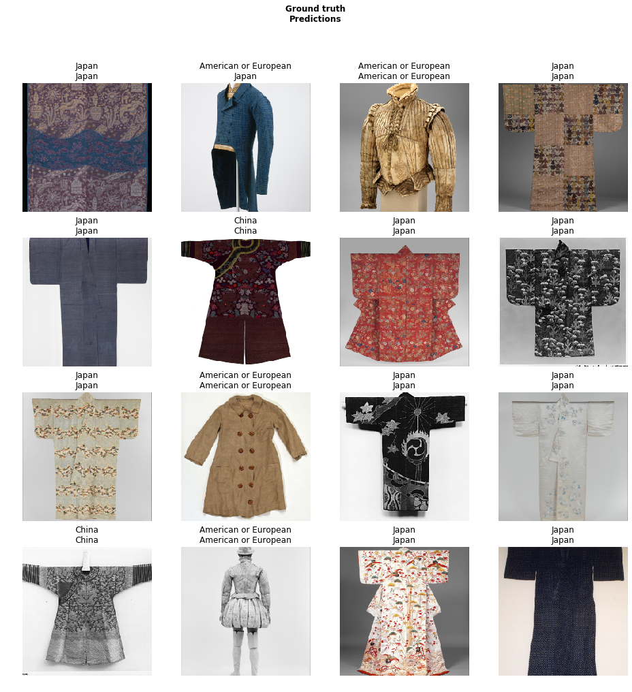
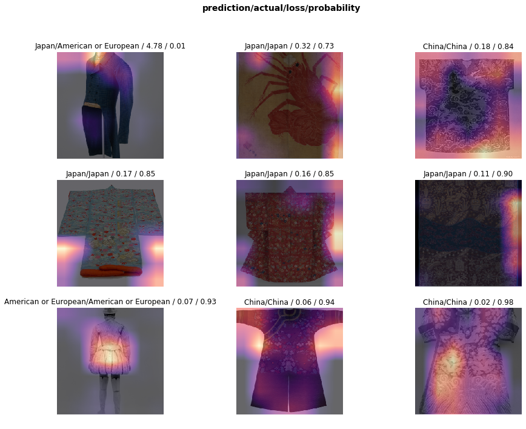
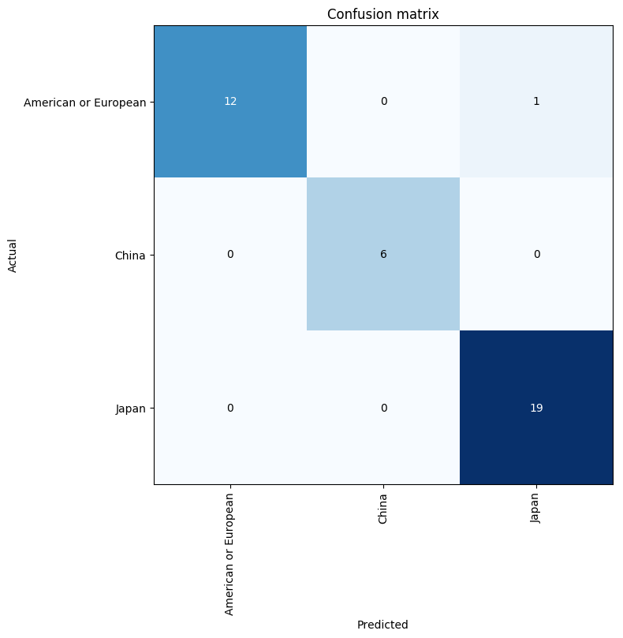

# Costumes Classification

### Abstract

Image classification have been an active research area of computer vision for years. Greater speed and larger accuracy have been achieved with the power of deep learning.  Furthermore, one can reuse a pre-trained model as a starting point to a second task. This technique is called *transfer learning*, utilizing feature map from pre-trained model to extract and process information for final classification. In this repository,  the vgg16 model with batch normalization pre-trained on ImageNet dataset is used to classify costumes data from The Metropolitan Museum of Art[1] into three categories.

### Data Description

This repository leverages the pre-trained `vgg16_bn` model and the costumes collection data at The Metropolitan Museum of Art and metadata from Google BigQuery[2]. The image data contains three categories: China, Japan, American or European.

**sample data**:

### Architecture

### Prediction

**model prediction**:

**model performance**:

[1]: <https://www.metmuseum.org/>
[2]: https://bigquery.cloud.google.com/dataset/bigquery-public-data:the_met?pli=1