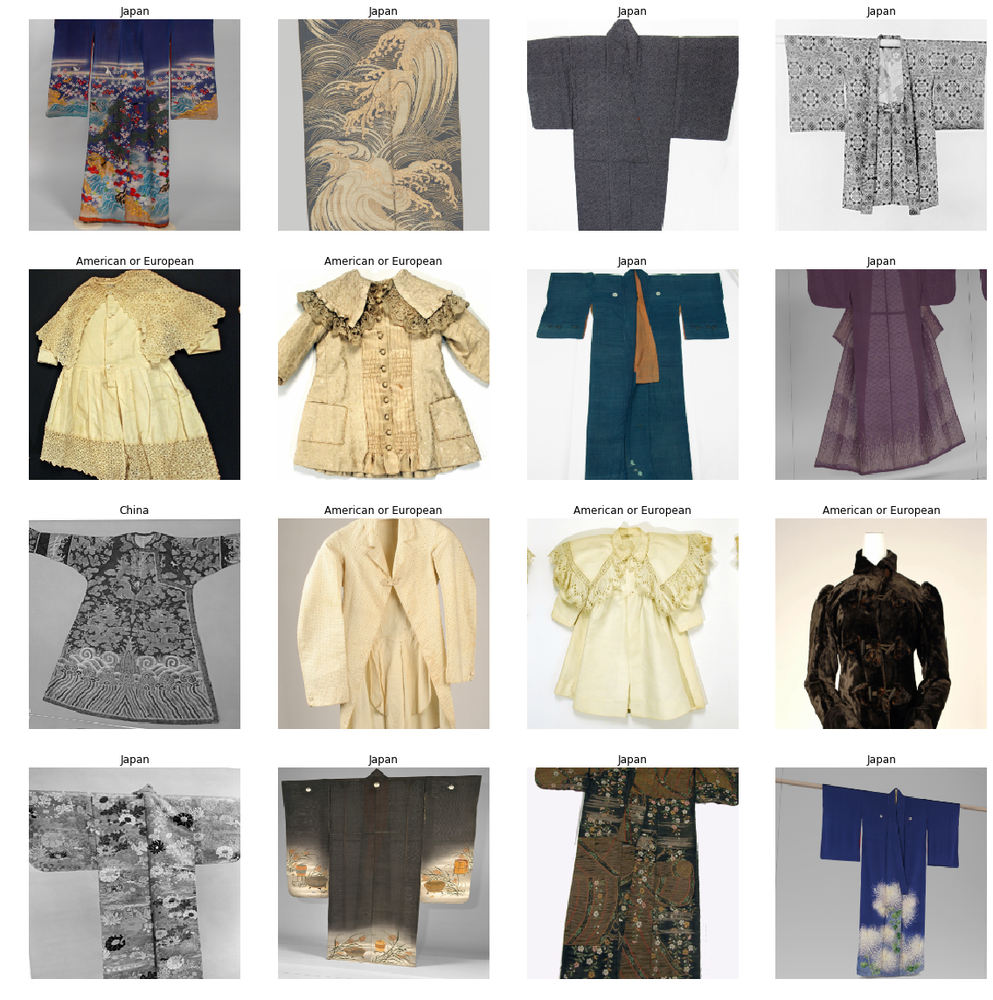
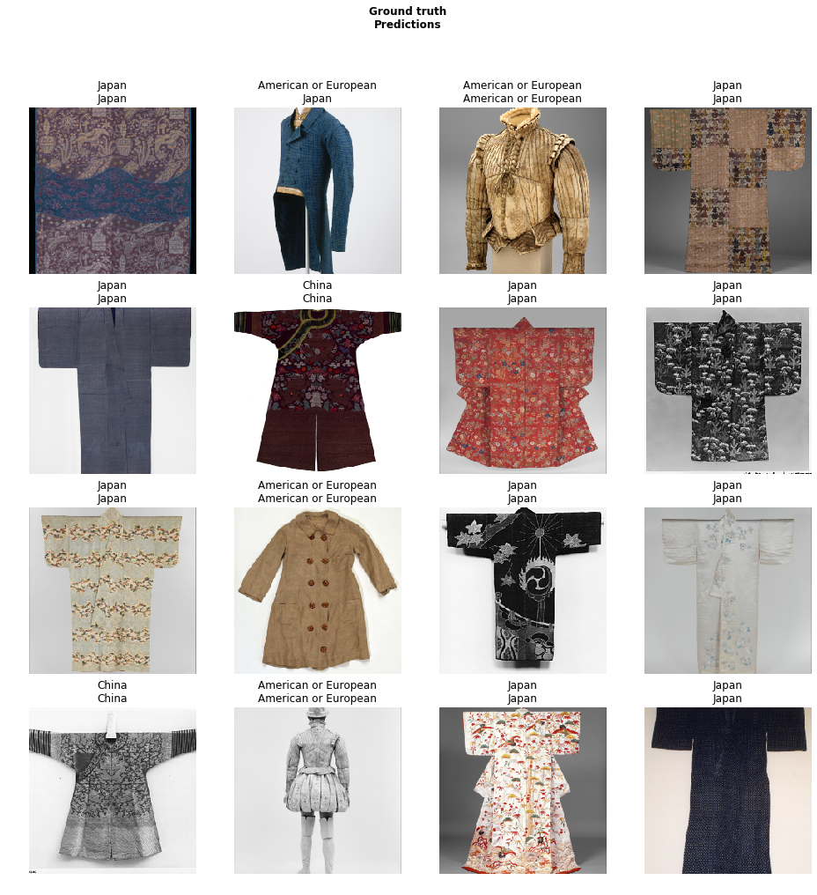
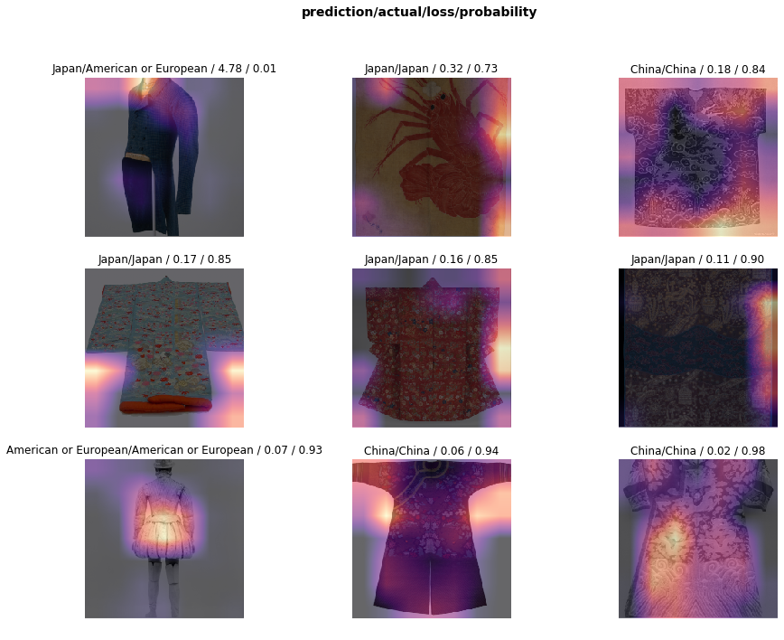
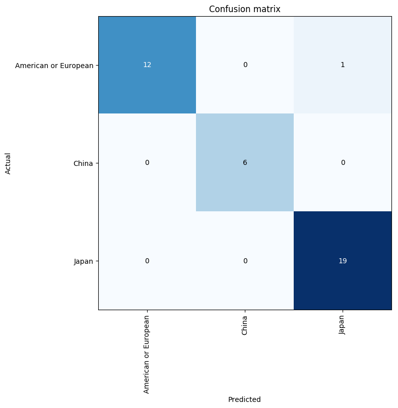

This repository leverages the pre-trained `vgg16_bn` model and the costumes collection data at The Metropolitan Museum of Art[1]and metadata from Google BigQuery[2].

A batch of data:

model prediction:

model performance:

[1]: <https://www.metmuseum.org/>
[2]: https://bigquery.cloud.google.com/dataset/bigquery-public-data:the_met?pli=1